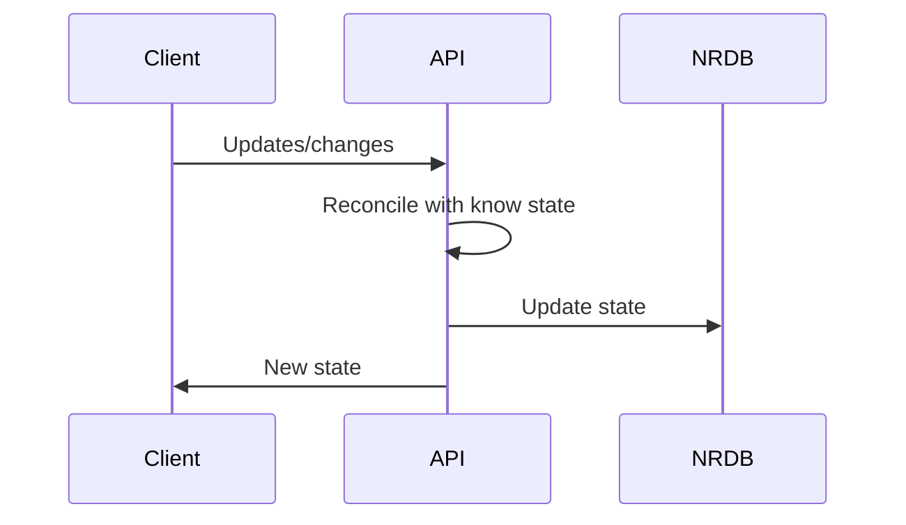

# System Architecture

Architecture will be comprised for 3 major parts: the client (browser), the API (microservice(s)), and an nonrelational database (NRDB, probably Azure Cosmos).  The client will be the GUI and be in constant communication with the API for updates and to push  updates.  The API will receive these updates and reconcile any conflicts.  Ultimately, the API will push updates to the state saved in the NRDB.  The NRDB is pure state for persistence.

